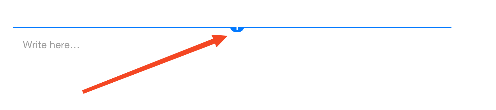
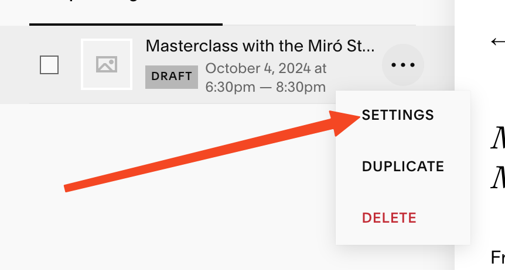

+++
weight = 20
title = "Add Event to YCM Website" 
+++ 

# Add Event to YCM Website
*A guide for adding events to the Young Chamber Musicians website through Squarespace*

## Initial Access and Login

1. **Open Your Web Browser**
   - Open your preferred web browser (such as Chrome, Firefox, or Safari)
   - In the address bar at the top of your browser, type "www.squarespace.com"

2. **Login to Squarespace**
   - Click the "Log In" button in the top right corner
   - Enter your Squarespace login credentials
   - Important Note: These credentials are different from your YCM email, even though the username might look similar

3. **Access the YCM Website**
   - After logging in, you'll see a list of websites
   - Look for and click on "Young Chamber Musicians"

4. **Navigate to Events Section**
   - On the left side menu, click on "Pages"
   - In the Pages section, locate and click on "Events"





## Creating a New Event

1. **Start New Event**
   - Look for and click the "+" button to create a new event
   - This button is typically located in a prominent position on the page

    

2. **Fill in Event Details**
   - For the Event Title:
     - If it's a concert, simply enter: %CONCERT_NAME%
     - If it's a master class, enter: "Masterclass with %GROUP_NAME%"
   - Under "Details" section:
     - Enter the event date
     - Enter the event time
     - Enter the location
   - Click the "Save" button to create the event

## Setting Up the Event Page

After saving, you'll see a blank page. To return to this page later, find it in the Events list from the previous section.

1. **Add the Event Photo**
   - Look for "Write here..." on the page
   - Click the "+" button that appears
   - Select "Image" from the menu
   - Click "Add Image"
   - Upload the event photo (use the same image that was used for the Zeffy event)



2. **Add Event Description**
   - Remove the default "Write here" block:
     - Click on the "Write here" text
     - Click the red trash can icon to delete it
   - Add a Markdown block:
     - Click the round plus sign
     - Scroll through options and select "Markdown"
   - Add event content:
     - Open the appropriate template based on your event type:
       - For concerts: [YCM Concert](https://docs.google.com/document/d/1PHa2GQwzagXFZqUza7aTvq-yBD3Q0XJe4pLJ58aPHvg/edit?usp=drive_link)
       - For YCM masterclasses: [YCM Masterclass](https://docs.google.com/document/d/1zbuitngYqgdltdoZG6OwKhE3ejA4AeuhOSKt8jnWKxc/edit?usp=drive_link)
       - For joint YCM/MAKM masterclasses: [YCM and MAKM Masterclass](https://docs.google.com/document/d/19g_URJdx1904pa000S_3X8N0KRz0vUsEmU73jcdjOJQ/edit?usp=drive_link)
     - Copy the template content
     - Paste into the Markdown block
     - Replace all placeholder text with actual event information

3. **Save Your Work**
   - Click "Save" in the top left corner
   - Click "Exit" to return to the events list

## Configuring Event Settings

1. **Access Event Settings**
   - In the events list, locate your new event
   - Click the three dots (⋮) next to the event
   - Select "Settings" from the dropdown menu



2. **Content Settings**
   - Featured Image:
     - Scroll down to find "Search For Image" below the grey box
     - Click it and select the same photo used earlier
     - Click "Add" at the bottom of the window
   - Add an Excerpt based on event type:

   For YCM Concerts:
   ```
   Young Chamber Musicians presents the xxx of xxx Winter Concerts. Admission free, but registration is required.
   ```

   For YCM Masterclasses:
   ```
   Young Chamber Musicians presents a Masterclass with %GROUP_NAME%.

   YCM presents this admission-free masterclass as a part of its vision of "advancing the artistry of extraordinary young musicians through the study and performance of chamber music." YCM dedicates this program to Mary Bianco with gratitude for her generous support.

   Admission free, but registration is requested.
   ```

   For YCM and MAKM Masterclasses:
   ```
   Young Chamber Musicians presents a Masterclass with %GROUP_NAME%.

   YCM presents this admission-free masterclass as part of our masterclass series in conjunction with Music at Kohl Mansion.

   Admission free, but registration is requested.
   ```

3. **Options Settings**
   - Find the "Options" section
   - Set Status to: Published
   - Set Categories to: Concerts

4. **Final Save**
   - Click the "Save" button on the left side of the settings popup

## Completion
Congratulations! You've successfully added an event to the YCM website. Consider treating yourself to a well-deserved break - perhaps with a Dark Chocolate Peanut Butter Cup from Trader Joe's!