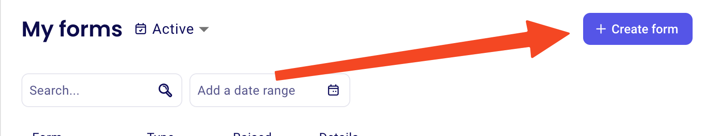

+++
weight = 10
title = "Add Event to Zeffy" 
+++ 

# Add Event to Zeffy
*A guide for creating event registration forms on Zeffy*

## Initial Access

1. **Open Your Web Browser**
   - Open your preferred web browser (Chrome, Firefox, Safari, etc.)
   - Type "zeffy.com" in the address bar
   - Press Enter

2. **Login to Zeffy**
   - Click the "Login" or "Sign In" button
   - Enter your Zeffy credentials
   - Note: These are different from your YCM email credentials, even if the username looks similar

## Creating a New Event Form

1. **Access Form Creation**
   - Look for and click "Forms" in the main side menu
   - Click the "Create Form" button in the top right corner
   

2. **Select Event Type**
   - On the next screen, click "Event"
   - Click "Start This Form"
   

## Entering Event Information

### For Concerts
1. **Basic Information**
   - Title Format: `[Year-Month-Day]-[Winter or Finale] Concert [Number]`
     Example: "2024-01-15-Winter Concert 1"
   - Language: Select "En" (English)
   - Description: Copy and paste:
     "YCM presents this admission-free concert as a part of its mission 'advancing the artistry of extraordinary young musicians through the study and performance of chamber music.'"

2. **Date and Location**
   - Enter the exact event date and time
   - For location:
     - Type the venue name or address
     - Select from search results
     - Verify the full address is correct

### For Masterclasses
1. **Basic Information**
   - Title Format: `[Year-Month-Day]-Masterclass with [Group Name]`
     Example: "2024-01-15-Masterclass with String Quartet"
   - Language: Select "En" (English)
   - Description: Copy and paste:
     "YCM presents this admission-free masterclass and performance as a part of its mission 'advancing the artistry of extraordinary young musicians through the study and performance of chamber music.' Please register below so that we can ensure that space will be available."

2. **Date and Location**
   - Enter the exact masterclass date and time
   - Input complete venue address
   - Verify address details are correct

## Setting Up Tickets

1. **Create Ticket Type**
   - Click "Add Ticket Type"
   - Enter:
     - Title: "Admission-free"
     - Price: $0.00
   - If venue has limited capacity:
     - Set maximum ticket quantity
   
2. **Enable Donations**
   - Find and enable the "Additional Donation" option
   

## Customizing the Event Page

1. **Brand Settings**
   - Logo:
     1. Access the YCM shared drives
     2. Navigate to the artwork folder
     3. Download the YCM logo
     4. Upload to Zeffy
   - Color: Enter YCM Purple (#5555E7)

2. **Event Banner**
   - Upload the approved publicity photo

3. **Configure Thank You Emails**

   For Concerts:
   - Find "Email Body"
   - Select "Template" dropdown
   - Choose "Concert Confirm"
   - Important: Verify the event address is correct
   - Note: The email subject will be automatically updated

   For Masterclasses:
   - Find "Email Body"
   - Select "Template" dropdown
   - Choose "Masterclass Confirm"
   - Important: Verify the event address is correct
   - Note: The email subject will be automatically updated

4. **Ticket Configuration**
   - Find "Ticket Settings"
   - Check the "Generate E-tickets" box
   - Leave the ticket banner empty (default artwork will be used)

## Finalizing the Event

1. **Create the Event**
   - Click "Create Event" in the top left
   - When the popup appears:
     - Copy the event URL
     - Save it for later use
   - Click the X in the top left to access Advanced Options
   

2. **Set Up Reminder Email**
   - Click "Set up event communications"
   - Find "Email Body"
   - Select appropriate template:
     - For concerts: "Concert Reminder"
     - For masterclasses: "Masterclass Reminder"
   - Verify the event address is correct
   - Click "Save" at the bottom of the email editor
   - Click "Save" again in the top left corner

## Completion
Congratulations on setting up your event! Take a well-deserved break and enjoy some fresh air and sunshine.

Important Note: When creating concert titles, do not include "No." before the concert number, as per Susan's preference.