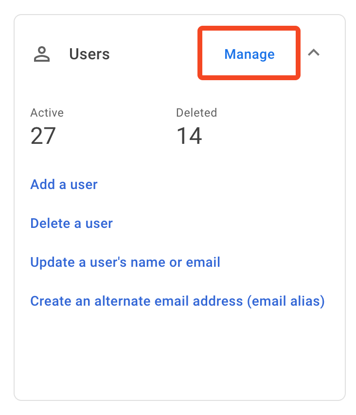
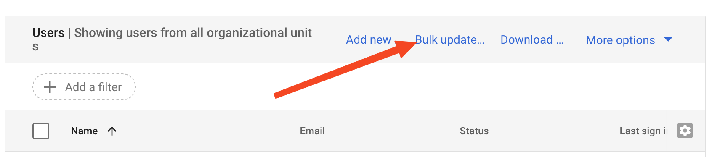
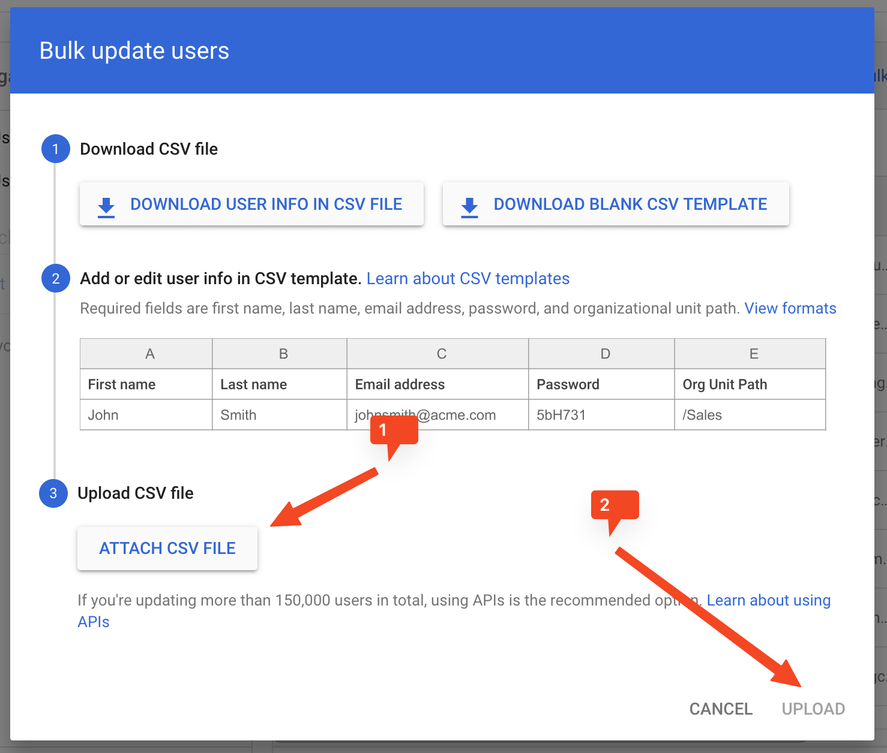
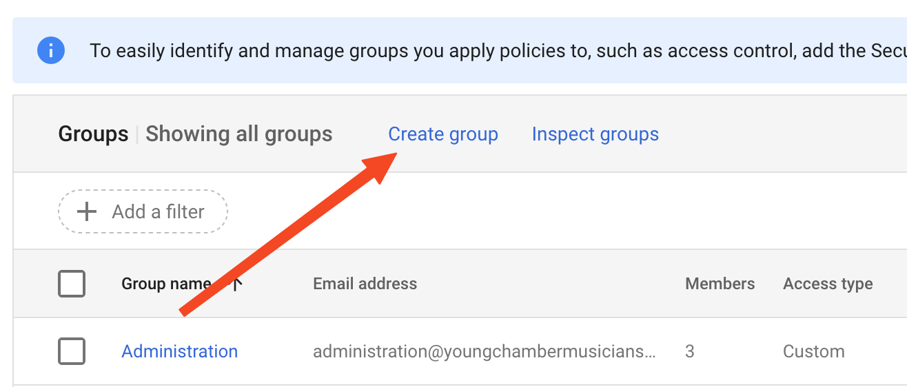
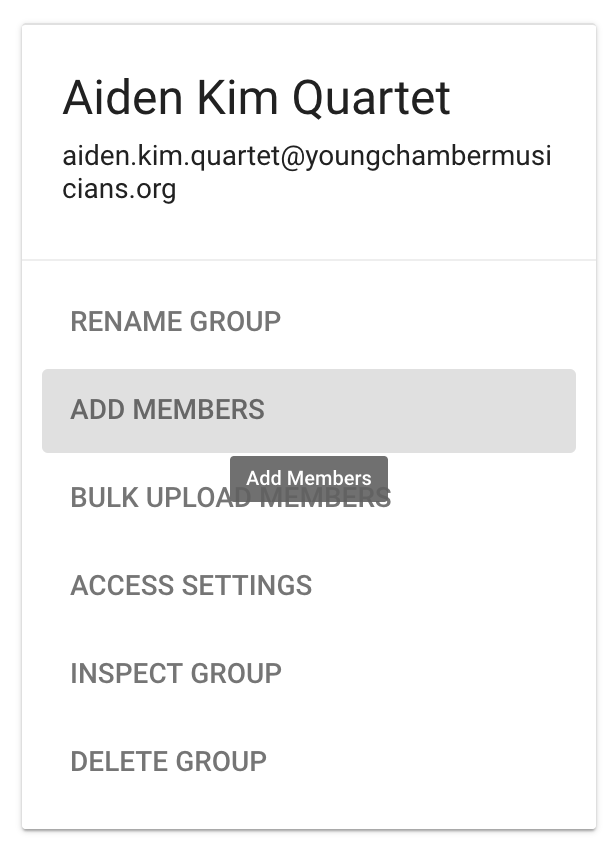

+++
title = "New User Setup" 
+++ 

# New User Setup 

## 0. Prerequisites 

- Completed roster for next season 

## Prepare New User Import 

- Download the [Bulk User Template](./users-template.csv) and fill out. This only 
  needs to be completed for new students. 

### Helpful cell formulas

- Email address: `=REGEXREPLACE(LOWER(CONCATENATE(A9,".",B9,"@students.youngchambermusicians.org")), "\-", ".")` 
- Password: `=DEC2HEX(RANDBETWEEN(1073741823, 4294967295), 10)`
  - Make sure you download the sheet when complete or the password will change on reload 

## Create Student Users in Admin Panel 

- Navigate to [admin.google.com](https://admin.google.com) 
- In the "Users" block, select "Manage" OR On the left menu select Directory>Users 

- At the top of the user list, select "Bulk Update..." 

- Click on "Attach CSV File" and select the template you just filled in. Then "Upload" 

- **Keep this CSV file until the end of this guide!**

## Create Student Groups in Admin Panel 

Note: Even if group names are still the temporary names, this needs to be done now 
in order to assign folder permissions easily in the next step. 

- On the left menu, select Directory>Groups 

- For every new ensemble, select "Create Group" 
    - Group Name: Group Name
    - Group Email: Lowercase Group name with "." in place of spaces. (e.g., Aves Trio => aves.trio) 
    - Keep youngchambermusicians.org in the next dropdown 
    - Group Description: Not needed 
    - Group Owners: ycm@youngchambermusicians.org   
    - [x] Apply Security Label Checkbox 

- On next screen
  - Access Type: Restricted 
  - Who can join: Only Invited Owners 
  - Do NOT switch "allow members outside..."

## Adding Students to Groups 

This is the last step to adding the new students -- adding them to user groups in 
order to make access rights easier to manage. 

- Like the [last step](#create-student-groups-in-admin-panel), you will again select 
Directory>Groups

- For every group you just created, click on the name to bring up the group manage screen

- Select "Add Members" on the left-middle part of the screen. 

- Add all members of the group as well as "administration@youngchambermusicians.org". This 
  will allow members of the administration group to send emails to the group. 

## Add groups to students group 

Go to the [group admin](#create-student-groups-in-admin-panel) one last time and look 
for the "Current Students" group. Click on the name and we are going to "Add Members" 
to this group. The procedure is exactly the same as the step above. However, as opposed 
to adding all of the individual students to this group, add all of the student ensemble 
groups to this folder. 

N.B., it would be great if I could automate this. And in the future it may be possible, 
but Google does not allow one to create dynamic groups on the Non-profit plan. 

## Take a break 

Get up and take a walk. This was one of the most involved processes in your job. You 
deserve to move around a little. Leave the world of the desk behind. 

