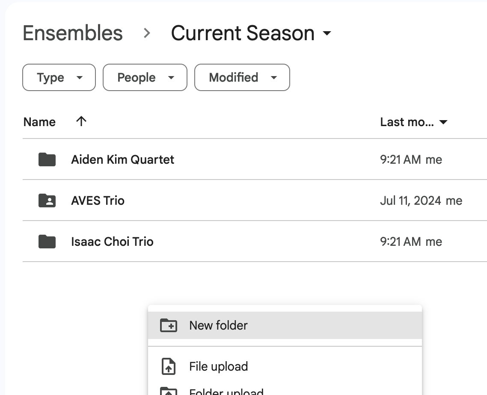

+++
title = "Setting up Student Folders"
+++ 

# Setting up Student Folders 

Eventually the group names *will* change unless it's a group that carried over from 
last year. Because Google tracks files and folders using an internal ID, it does not 
matter much that we change this name at a later time. So use the temporary name that 
was created when filling out the roster. 

- Navigate to Shared Drives>Ensembles>Current Season 
- Create a new folder for each new ensemble. If you do not have the student chosen 
  name for their ensemble, use the temporary ensemble name.  
  

- Because I don't think you can replicate a folder, in each folder, create the following: 
  - A folder for the student bios named "Bios" 
  - A folder for the A/V releases named "Photo/Video Releases" 
  - A folder for official group pictures named "Photos" 
  - Shortcuts to these files: 
    - https://docs.google.com/document/d/1GVu0EXim9MOR3sxeXby-ymBtwdjoG-v1UDnmVFqGkEY
    - Current Year's roster (Make sure that private teacher information is not on the roster)

Share the folder with the ensemble group created in the last stage. Add them as a 
"Contributor" to the folder. 