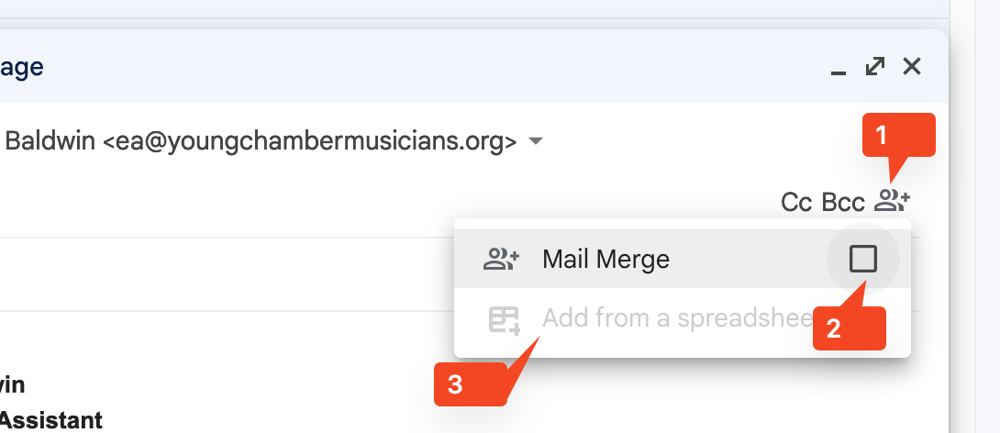
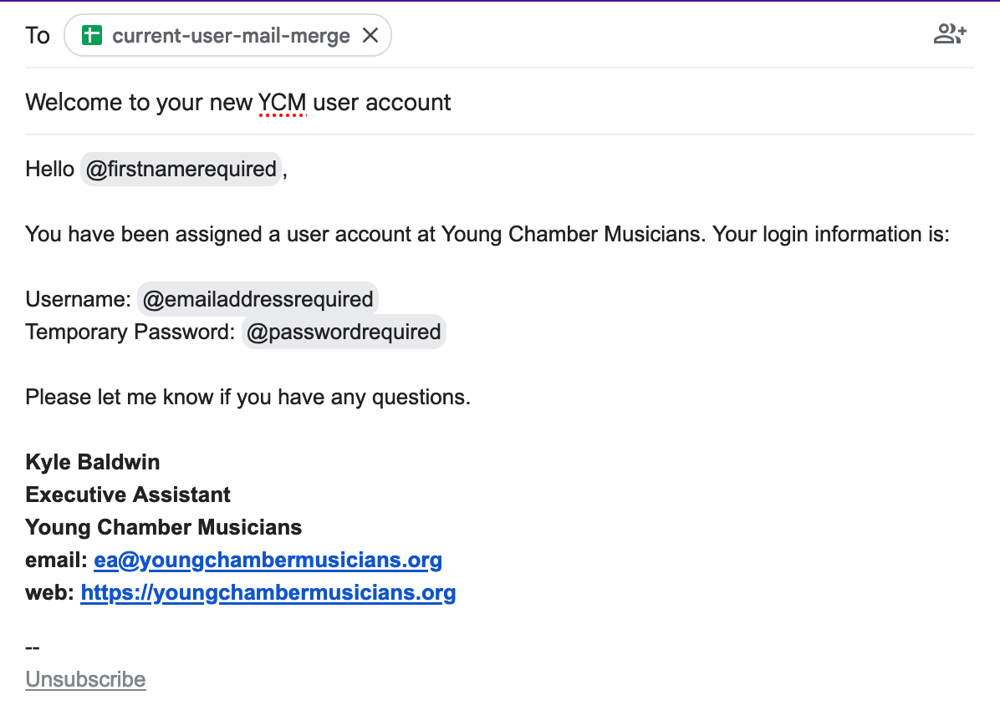

+++
title = "Student Introduction Email" 
+++

# Student/Parent Introduction Email 

*Note: Although this is directed to students and parents who are new to the YCM 
organization, this will get sent to all students and parents as it can also serve 
as a refresher.* 

## Prerequisites 

- The completed template used to create the student accounts 
  - If you lost this or got rid of it after seeing "Keep this CSV file until the 
    end of this guide!"... you're going to have a bad time. 
- Associated personal student emails and parent emails for each student 
- Completed roster with students and parents emails 

## Upload the CSV into Google Drive 

This needs to be done in order to select it in the next step 

Convert to Google Sheet 

Duplicate list so that every student has a line that will go to their personal email 
and one line that will go to the parent 

Note location of upload 

## Create the mail merge for usernames and passwords 

- Login into [Gmail](https://mail.google.com)
- Click on the compose button to create a new email 
- When entering the "To:" field, do not type anything yet but rather click on the 
  mail merge icon 
- After clicking on the icon, select the checkbox that says "Mail Merge" 
- The option to "Add from a Spreadsheet" should now be available. Select the *Google Sheet* 
  file you just uploaded. Not the CSV file 

- Select correct fields for email and first/last name 
- Open the [new user account template](./new-user-account-template.md) and copy 
  into the email body. 
- Edit the email body by replacing the variables in `${variable}` notation. When 
  replacing in Google Mail, column names need to be prefixed with an `@` 
- When finished, it should look something like this 

- Click continue at bottom and then "Send All" on the next screen 

## Send welcome email to all users explaining account 

- Create new email 
- Take markdown in [Welcome email template](./introduction-template.md) and convert to 
  HTML (http://demo.showdownjs.com/ works well. Dillinger does not)
- Paste into email body 
- In the To field, send to yourself 
- In the CC field, copy Susan 
- Add all parents and students in the BCC field. This cuts down on possible reply-all 
  problems for users who are not as tech savvy 
- Double check the email and hit send! 