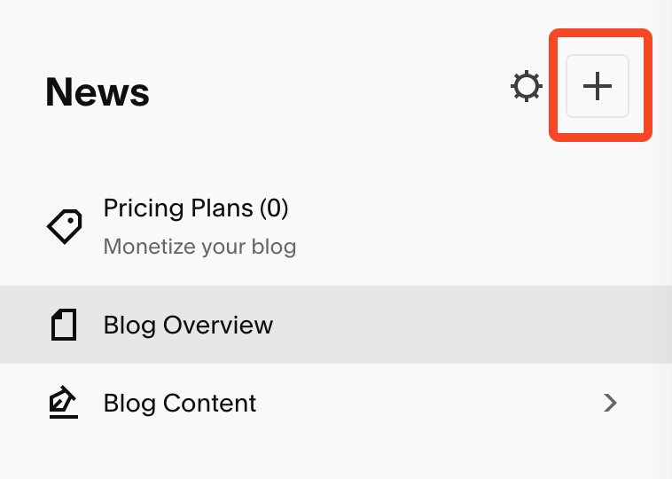
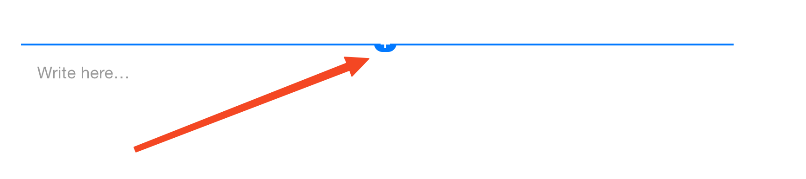
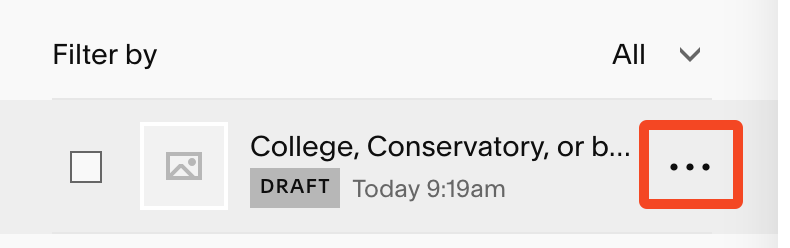

+++
title = "Add a Blog Post" 
+++ 

# Add a Blog Post


This guide will walk you through the process of logging into Squarespace, creating a new blog post, and publishing it on the Young Chamber Musicians website. 

## Logging into Squarespace

1. **Open your web browser** and go to the Squarespace website by typing [www.squarespace.com](http://www.squarespace.com) into the address bar at the top of the browser. Press `Enter` on your keyboard.

2. **Log in to your account**:
   - Click on the "Log In" button in the top-right corner of the page.
   - Enter the email address and password for your Squarespace account.  
     **Note**: This login information is different from your YCM email, even if the email username is the same.

3. **Select the Young Chamber Musicians website**:
   - After logging in, you will see a list of websites associated with your account. Click on the one named "Young Chamber Musicians."

4. **Navigate to the "News" section**:
   - On the left-hand menu, click on **"Pages."**
   - Scroll down and click on **"News."** This is where all blog posts are managed.

     
     

---

## Creating a New Blog Post

1. **Start a new blog draft**:
   - In the "News" section, click the **"+" button** (usually located at the top or bottom of the page) to create a new blog post draft.

   

---

## Writing Blog Content

Most blog posts are short updates or announcements that Susan wants to share with the community. Follow this format unless the post requires a more detailed structure.

1. **Add an image to your post**:
   - In the draft, click the **"+"** where it says **"Write here..."** and select **"Image"** from the menu.

   

   - Click **"Add Image"** and upload the image you want to include in the post.  
     **Tip**: Make sure the image is relevant to the content of the post.

2. **Write your blog content**:
   - Below the image, click where it says **"Write here..."** and type your blog post content.  
     **Tip**: Keep the text concise and clear for easy reading.

3. **Save your draft**:
   - Once you’ve added the image and written your content, click **"Save"** in the top-left corner to save your work as a draft.
   - Click **"Exit"** to return to the main "News" page.

---

## Publishing the Blog Post

After saving your draft, you’ll return to the "News" section. Follow these steps to publish your post:

1. **Locate your draft**:
   - Under the **"Blog Content"** section, find the draft you just created.

2. **Edit the post settings**:
   - Hover over the draft entry with your cursor, and click on the **three dots (···)** that appear.

   

   - Select **"Settings"** from the dropdown menu.

3. **Add a featured image**:
   - In the left-hand menu, click on **"Content."**
   - Upload a **featured image**. This image will appear as a thumbnail for your blog post.  
     **Note**: The featured image should be square-shaped. If your image is rectangular, you can use a tool like Imagemagick to resize it. Use the following command in Imagemagick:  
     ```
     magick input.jpg -gravity center -extent "%[fx:w]x%[fx:w]" output.jpg
     ```  
     Replace `input.jpg` with the name of your image file.

4. **Add a short excerpt**:
   - Below the featured image, write a brief summary of your blog post in the **"Excerpt"** field. This will appear as a preview of your post.

5. **Set the post status to "Published"**:
   - In the left-hand menu, click on **"Options."**
   - Under **"Status,"** change the setting from "Draft" to **"Published."**

6. **Save and publish**:
   - Click **"Save"** in the top-left corner to finalize your changes.  
     **Note**: Once saved, your blog post will be live on the Young Chamber Musicians website.
