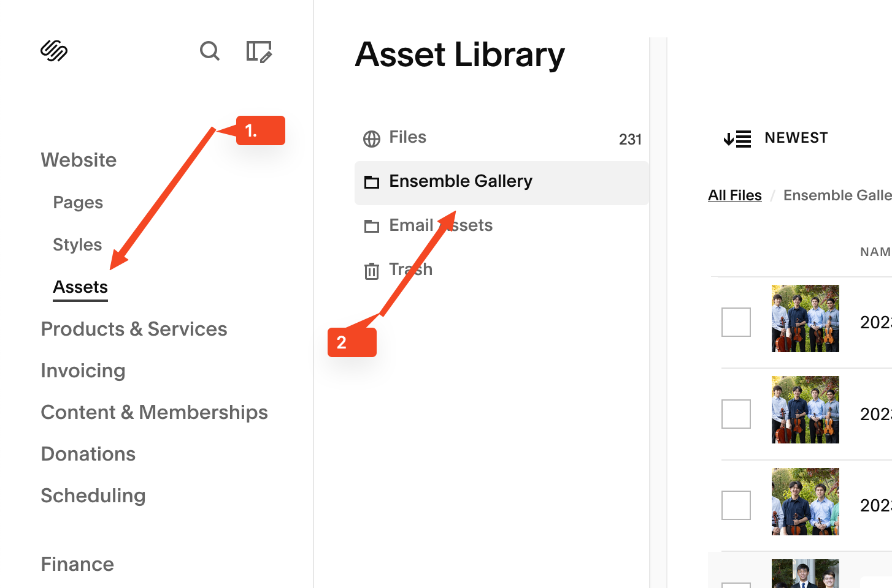
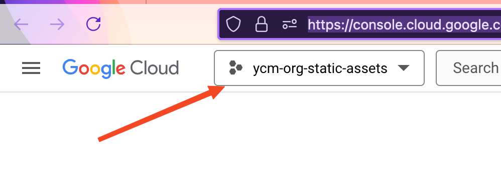
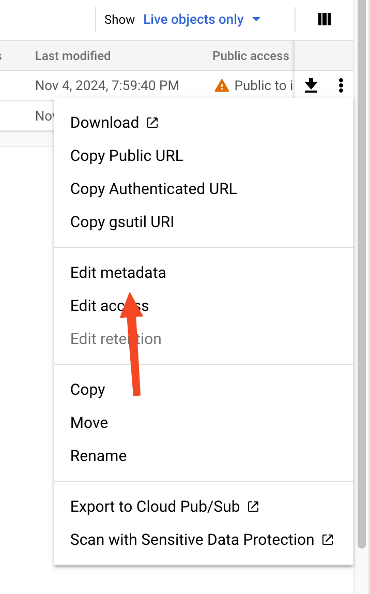

+++
title = "Update External Javascript" 
+++ 

# How to Update External JavaScript for the Timeline and Ensemble Gallery

This guide will walk you through the process of updating the external JavaScript and CSS files that control the timeline and ensemble gallery on the Young Chamber Musicians (YCM) website. These files are stored on the YCM GitHub account and hosted on Google Cloud. Follow each step carefully.

## Required Software and Platforms

Before starting, ensure you have access to the following tools and platforms:

1. **React (Typescript/Vite.js)**: The main program used to generate and run the component injection and functions.
2. **Node.js and Yarn**: Used for compiling the code and installing necessary packages.
3. **CSS**: Used for styling the components.
4. **Google Cloud**: Hosts the `.js` and `.css` assets.
5. **Photo Editing Software**: Affinity Photo or similar software for editing ensemble photos.


## Adding Ensembles to the Gallery

### Step 1: Prepare Ensemble Photos

1. **Create Thumbnails**:
   - Locate the ensemble photos in the `Ensembles Photos` folder. These photos are typically taken at the beginning of the year.
   - Use photo editing software (e.g., Affinity Photo) to create thumbnails with a **3:2 aspect ratio**. Export the thumbnails at a small size (e.g., ~500px width).

### Step 2: Upload Photos to Squarespace

1. **Log in to the YCM Squarespace account**:
   - Go to [www.squarespace.com](http://www.squarespace.com) and log in using your YCM Squarespace credentials.

2. **Locate the Ensemble Gallery**:
   - Navigate to **Website > Pages > Website Tools**.
   - Find the ensemble gallery in the website assets.

   

3. **Upload Photos**:
   - Upload both the full-sized photos and the thumbnails to the ensemble gallery folder.
   - Use a consistent file naming format for easier editing later:  
     `{year}-{ensemble name}-{thumbnail?}`  
     Example: `2023-Bluuuuuu-String-Quartet-thumbnail.jpg`

### Step 3: Update Ensemble Data

1. **Edit the Ensemble Data File**:
   - Open the YCM GitHub repository: [YCM GitHub](https://github.com/YoungChamberMusicians/squarespace-js).
   - Locate the file `./src/EnsembleGallery/ensembleData.ts`.
   - Add the new ensemble data to this file. Include:
     - **Thumbnail URL**: URL of the thumbnail image.
     - **Image URL**: URL of the full-sized image.
     - **Ensemble Members**: Names of the members in the order they appear in the photo.
     - **Notes**: Any special awards or notable comments.

   **Note**: To get the image URLs, click on the file details in Squarespace, right-click the large image, and select **"Copy Image Link."**

### Step 4: Build the Files

1. **Install Dependencies**:
   - Open a terminal or command prompt.
   - Navigate to the project folder (where the GitHub repository is cloned).
   - Run the following command to install dependencies:
     ```bash
     yarn install
     ```

2. **Build the Files**:
   - Run the following command to compile the code:
     ```bash
     yarn run build
     ```
   - The compiled files will be saved in the `./dist` folder.

### Step 5: Upload Files to Google Cloud

1. **Log in to Google Cloud**:
   - Go to [Google Cloud Console](https://console.cloud.google.com/welcome).
   - Select the `ycm-org-static-assets` project.

   

2. **Access Cloud Storage**:
   - Click on **Cloud Storage** in the left-hand menu.
   - Select the `ycm-assets` bucket.

   

3. **Create a New Folder**:
   - Create a new folder named `dist-{year}-{month}-{day}` (e.g., `dist-2023-10-15`).

4. **Upload Files**:
   - Upload the following files from the `./dist` folder:
     - `./dist/assets/{hash}.js`
     - `./dist/assets/{hash}.css`
   - After uploading, click on each file, select **Edit Metadata**, and set the `Cache-Control` field to:
     ```
     public, max-age=604800, immutable
     ```

   

5. **Copy Public URLs**:
   - For both files, click the three dots (···) and select **Copy Public URL**. Save these URLs for the next step.

---

### Step 6: Update Squarespace Code Injection

1. **Log in to Squarespace**:
   - Go to [www.squarespace.com](http://www.squarespace.com) and log in.

2. **Access Code Injection**:
   - Navigate to **Website > Pages > Website Tools**.
   - Under **Custom Code**, select **Code Injection**.

3. **Update Header Code**:
   - In the **Header** box, delete the existing code and replace it with:
     ```html
     <link rel="stylesheet" type="text/css" href="{CSS_URL}" />
     ```
   - Replace `{CSS_URL}` with the public URL of the `.css` file you copied earlier.

4. **Update Footer Code**:
   - In the **Footer** box, add the following code:
     ```html
     <script src="{JS_URL}"></script>
     ```
   - Replace `{JS_URL}` with the public URL of the `.js` file you copied earlier.

5. **Save Changes**:
   - Click **Save** at the top of the page.


## Why Use Google Cloud?

Squarespace does not allow direct file uploads for caching purposes unless you create the theme. They do, however, allow copy/pasting code that gets injected into the page. By hosting the `.js` and `.css` files on Google Cloud, the files can be cached by the browser, improving page load times. This method ensures that the files are downloaded once and reused on subsequent page reloads.

